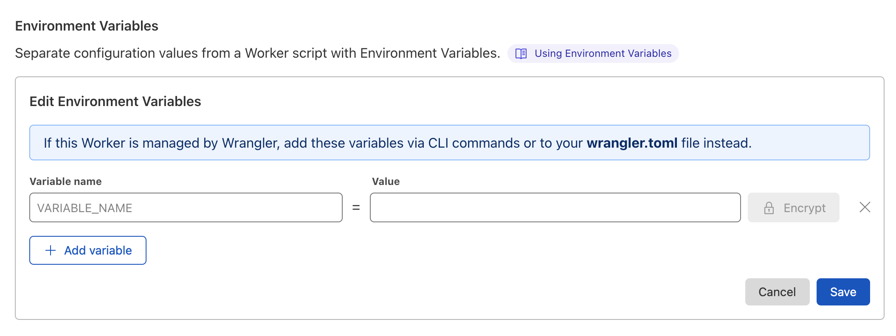
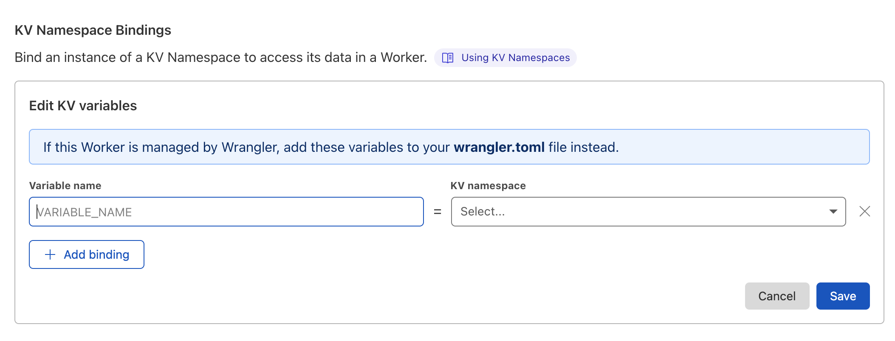
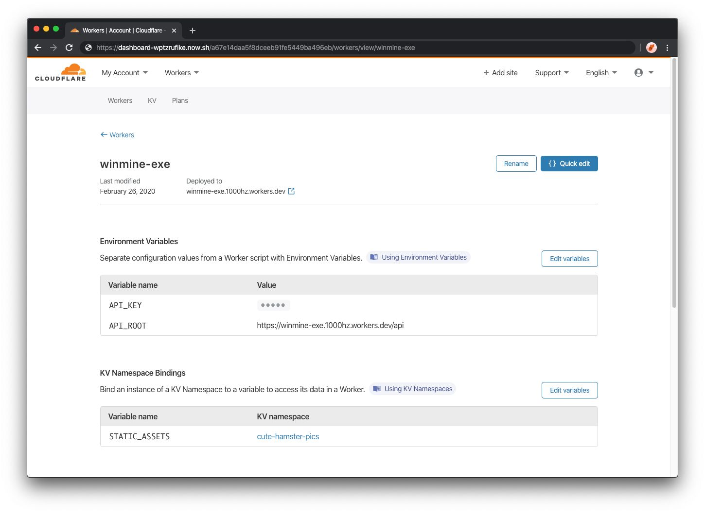

# Environments

<Aside>

__Note__: You can only use environments with [wrangler](/cli-wrangler).

</Aside>

## Background

Environments are different contexts that your code runs in. The Workers platform allows you to create and manage different environments. Through environments, you can deploy the same project to multiple places under multiple names.

These environments are utilized with the `--env` or `-e` flag on `wrangler build`, `wrangler dev`, `wrangler preview`, `wrangler publish`, and `wrangler secret`.

--------------------------------

## Usage

You will likely use environments to deploy Workers to a staging subdomain before your production environment. `wrangler publish` will determine its destination by the top-level configuration in your `wrangler.toml` [file](/cli-wrangler/commands#generate). You can create other environments beneath the top-level configuration in the `wrangler.toml` file by adding an [`[env.name]` configuration](https://developers.cloudflare.com/workers/cli-wrangler/configuration#environments) and specifying additional keys and values. For details on what keys are inherited by environments from the top-level configuration, see [`wrangler.toml` configuration](/cli-wrangler/configuration#keys).

The layout of a top-level configuration in a `wrangler.toml` file is displayed below:

```toml
---
filename: wrangler.toml
---
name = "your-worker"
type = "javascript"
account_id = "your-account-id"

# This field specifies that the Worker
# will be deployed to a *.workers.dev domain
workers_dev = true

# -- OR --

# These fields specify that the Worker
# will deploy to a custom domain
zone_id = "your-zone-id"
routes = ["example.com/*"]
```

### Naming

You cannot specify multiple environments with the same name. If this were allowed, publishing each environment would overwrite your previously deployed Worker and the behavior would not be clear.

For this reason, Wrangler appends the environment name to the top-level name to publish a Worker script. For example, a Worker project named `my-worker` with an environment `[env.dev]` would become `my-worker-dev`.

The layout of an example `[env.dev]` environment is displayed below:

```toml
---
filename: wrangler.toml
---
name = "your-worker"
type = "javascript"
account_id = "your-account-id"

[env.dev]
name = "your-worker-dev"
route = "your-custom-route"
```

The layout of an example `[env.dev]` environment is displayed below:

```toml
---
filename: wrangler.toml
---
name = "your-worker"
type = "javascript"
account_id = "your-account-id"

[env.dev]
name = "your-worker-dev"
route = "your-custom-route"
```

--------------------------------

## Examples

### Top-level configuration

#### Publishing to a custom domain

This `wrangler.toml` file has no environments defined and will publish `my-worker` to `example.com/*`.
The `workers_dev` key is missing from this example, but because a route is specified, the inferred value of `workers_dev` is `false`.

```toml
---
filename: wrangler.toml
---
type = "webpack"
name = "my-worker"
account_id = "12345678901234567890"

# These fields specify that the Worker
# will deploy to a custom domain
zone_id = "09876543210987654321"
route = "example.com/*"
```

To deploy this worker, run the `wrangler publish` command like the example below:

```sh
~/my-worker $ wrangler publish
✨  Built successfully, built project size is 523 bytes.
✨  Successfully published your script to example.com/*
```

#### Publishing to *.workers.dev

Your `*.workers.dev` subdomain allows you to deploy Workers scripts [without attaching a custom domain as a Cloudflare zone](https://blog.cloudflare.com/announcing-workers-dev/). To claim a `*.workers.dev` subdomain, such as `my-subdomain.workers.dev`, select the **Workers** icon on your account home, or **Workers** then **Manage Workers** on your zone's dashboard, and begin setup on the right side of the Workers dashboard under **Your subdomain**.

This `wrangler.toml` file has no environments defined and will publish `my-worker` to `my-worker.<your-subdomain>.workers.dev`:

```toml
---
filename: wrangler.toml
---
type = "webpack"
name = "my-worker"
account_id = "12345678901234567890"

# this field specifies that the worker
# should be deployed to *.workers.dev
workers_dev = true
```

This example will publish to your `*.workers.dev` subdomain because `workers_dev` has been set to `true`.

Run `wrangler publish` as normal to deploy your Worker script:

```sh
~/my-worker $ wrangler publish
✨  Built successfully, built project size is 523 bytes.
✨  Successfully published your script to https://my-worker.<your-subdomain>.workers.dev
```

### Introducing environments

Environments enable you to write and deploy projects to multiple places.

You can define an environment by specifying an `[env.name]` block with its own values in your `wrangler.toml` file. Values within this block may override top-level configuration values with the same key.

The `wrangler.toml` file below adds two environments, `[env.staging]` and `[env.production]`, to the `wrangler.toml` file. If you are deploying to a custom domain, you must provide a [`route` or `routes` key](/cli-wrangler/configuration#keys) for each environment if you are deploying to a custom domain.

```toml
---
filename: wrangler.toml
---
type = "webpack"
name = "my-worker-dev"
account_id = "12345678901234567890"
zone_id = "09876543210987654321"
route = "dev.example.com/*"
vars = { ENVIRONMENT = "dev" }

[env.staging]
name = "my-worker-staging"
vars = { ENVIRONMENT = "staging" }
route = "staging.example.com/*"

[env.production]
name = "my-worker"
vars = { ENVIRONMENT = "production" }
routes = [
  "example.com/foo/*",
  "example.com/bar/*"
]
```

In order to use environments with this configuration, you can pass the name of the environment via the `--env` flag.

With this configuration, Wrangler will behave in the following manner:

```sh
~/my-worker $ wrangler publish
✨  Built successfully, built project size is 523 bytes.
✨  Successfully published your script to dev.example.com/*
```

```sh
~/my-worker $ wrangler publish --env staging
✨  Built successfully, built project size is 523 bytes.
✨  Successfully published your script to staging.example.com/*
```

```sh
~/my-worker $ wrangler publish --env production
✨  Built successfully, built project size is 523 bytes.
✨  Successfully published your script to example.com/*
```

Any defined environment variables (the [`vars`](/cli-wrangler/configuration#vars) key) are exposed as global variables to your Worker.

With this configuration, the `ENVIRONMENT` variable can be used to call specific code depending on the given environment:

```js
if (ENVIRONMENT === "staging") {
  // staging-specific code
} else if (ENVIRONMENT === "production") {
  // production-specific code
}
```

### Staging Environment with workers.dev

In order to deploy your code to your `*.workers.dev` subdomain, include `workers_dev = true` in the desired environment. Your `wrangler.toml` file may look like this:

```toml
---
filename: wrangler.toml
---
name = "my-worker"
type = "webpack"
account_id = "12345678901234567890"
zone_id = "09876543210987654321"
route = "example.com/*"

[env.staging]
workers_dev = true
```

With this configuration, Wrangler will behave in the following manner:

```sh
~/my-worker $ wrangler publish
✨  Built successfully, built project size is 523 bytes.
✨  Successfully published your script to example.com/*
```

```sh
~/my-worker $ wrangler publish --env staging
✨  Built successfully, built project size is 523 bytes.
✨  Successfully published your script to https://my-worker-staging.<your-subdomain>.workers.dev
```

### workers.dev as a first-class target

If you want to connect multiple environments to your `*.workers.dev` subdomain, you must assign a different `name` per environment. This allows your Worker to be uploaded as different scripts, each owning its own set of environment variables, secrets, and KV namespaces. Configure your `wrangler.toml` file like the example below:

```toml
---
filename: wrangler.toml
---
name = "my-worker-dev"
type = "webpack"
account_id = "12345678901234567890"
workers_dev = true

[env.production]
name = "my-worker"

[env.staging]
name = "my-worker-staging"
```

With this configuration, deploy each environment by attaching a `--env` or `-e` flag and the name of the environment like the examples below:

```sh
~/my-worker $ wrangler publish
✨  Built successfully, built project size is 523 bytes.
✨  Successfully published your script to https://my-worker-dev.<your-subdomain>.workers.dev
```

```sh
~/my-worker $ wrangler publish --env staging
✨  Built successfully, built project size is 523 bytes.
✨  Successfully published your script to https://my-worker-staging.<your-subdomain>.workers.dev
```

```sh
~/my-worker $ wrangler publish --env production
✨  Built successfully, built project size is 523 bytes.
✨  Successfully published your script to https://my-worker.<your-subdomain>.workers.dev
```

--------------------------------

## Custom webpack configurations

You can specify different webpack configurations for different environments.

```toml
---
filename: wrangler.toml
---
name = "my-worker-dev"
type = "webpack"
account_id = "12345678901234567890"
workers_dev = true
webpack_config = "webpack.dev.js"

[env.production]
name = "my-worker"
webpack_config = "webpack.config.js"

[env.staging]
name = "my-worker-staging"
```

Your default `wrangler build`, `wrangler preview`, and `wrangler publish` commands will all build with `webpack.dev.js`. Any commands tied to the staging environment will also use this configuration; for example, `wrangler build -e staging`, `wrangler preview -e staging`, and `wrangler publish -e staging`.

The build commands `wrangler build -e production`, `wrangler preview -e production`, and `wrangler publish -e production` would all use your `webpack.config.js` file.

--------------------------------

## Environment variables

In the Workers platform, environment variables, secrets, and KV namespaces are known as bindings. Regardless of type, bindings are always available as global variables within your Worker script.

### Adding environment variables via wrangler

* Environment variables are defined via the `[vars]` config in your `wranger.toml` file and are always plaintext values.

    ```toml
    ---
    filename: wrangler.toml
    ---
    name = "my-worker-dev"
    type = "javascript"

    account_id = "<YOUR ACCOUNTID>"
    workers_dev = true

    # Define top-level environment variables
    # under the `[vars]` block using
    # the `key = "value"` format
    [vars]
    API_TOKEN = "example_dev_token"
    STRIPE_TOKEN = "pk_xyz1234_test"

    # Override values for `--env production` usage
    [env.production]
    name = "my-worker-production"
    [env.production.vars]
    API_TOKEN = "example_production_token"
    STRIPE_TOKEN = "pk_xyz1234"
    ```

    These environment variables can then be accessed within your Worker script as global variables. They will be plaintext strings.

    ```js
    // Worker code:
    console.log(API_TOKEN);
    //=> (default) "example_dev_token"
    //=> (env.production) "example_production_token"

    console.log(STRIPE_TOKEN);
    //=> (default) "pk_xyz1234_test"
    //=> (env.production) "pk_xyz1234"
    ```

* KV namespaces are defined via the [`kv_namespaces`](/cli-wrangler/configuration#kv_namespaces) config in your `wrangler.toml` and are always provided as [KV runtime instances](/runtime-apis/kv).

    ```toml
    ---
    filename: wrangler.toml
    ---
    name = "my-worker-dev"
    type = "javascript"

    account_id = "<YOUR ACCOUNTID>"
    workers_dev = true

    [[kv_namespaces]]
    binding = "Customers"
    preview_id = "<PREVIEW KV NAMESPACEID>"
    id = "<DEV KV NAMESPACEID>"

    [env.production]
    name = "my-worker-production"
    [[kv_namespaces]]
    binding = "Customers"
    id = "<PRODUCTION KV NAMESPACEID>"
    ```

* Secrets are defined by running [`wrangler secret put <NAME>`](/cli-wrangler/commands#secret) in your terminal, where `<NAME>` is the name of your binding. You may assign environment-specific secrets by re-running the command `wrangler secret put <NAME> -e` or `wrangler secret put <NAME> --env`. Keep a list of the secrets used in your code in your `wrangler.toml` file, like the example under `[secrets]`:

    ```toml
    ---
    filename: wrangler.toml
    ---
    name = "my-worker-dev"
    type = "javascript"

    account_id = "<YOUR ACCOUNTID>"
    workers_dev = true

    # [secrets]
    # SPARKPOST_KEY
    # GTOKEN_PRIVKEY
    # GTOKEN_KID
    ```

<Aside type="warning">

\* __Warning:__ Do not use plaintext environment variables to store sensitive information. Use [`wrangler secret put`](/cli-wrangler/commands#secret) instead.

</Aside>

### Adding environment variables via the dashboard

Add environment variables by logging into [Cloudflare dashboard](https://dash.cloudflare.com/) > **Account Home** > **Workers** and select your Workers script. 

To add environment variables, such as `vars` and `secrets`, go to your **Workers script** > **Settings** > **Add variable** under **Environment Variables**.

Input a **Variable name** and its **value**, which will be made available to your Worker. If this variable is a `secret`, select  **Encrypt** to protect its value. This will prevent the value from being visible via `wrangler` and the dashboard. 

If the variable is not a secret, do not press **Encrypt**. 

To add multiple environment variables, select **Add variable**. When you are finished, select **Save** to implement your changes.



To add KV namespace bindings, go to your **Workers script** > **Settings** > **Add binding** under **KV Namespace Bindings**.

Choose a **Variable name**. This will be the way the variable name will be referenced in your Worker script. Next, select a **KV namespace** from the dropdown. Select **Add binding** to add multiple bindings. When you are finished, select **Save** to implement your changes.



Your completed Workers dashboard, with environment variables and KV namespace bindings added, will look like the following example reference. 



--------------------------------

## Invalid configurations

### Multiple types

You cannot specify multiple `type` values. The `type` must be specified at the top level of your `wrangler.toml` file.

```toml
---
filename: wrangler.toml
---
name = "my-worker"
type = "webpack"
account_id = "12345678901234567890"
zone_id = "09876543210987654321"
route = "example.com/*"
workers_dev = true

[env.staging]
type = "rust"
```

With this configuration, no errors will be thrown. However, only `type = "webpack"` will be used, even in an `--env production` setting.

### Same name for multiple environments

You cannot specify multiple environments with the same name. If this were allowed, publishing each environment would overwrite your previously deployed Worker, and the behavior would not be clear.

```toml
---
filename: wrangler.toml
---
name = "my-worker"
type = "webpack"
account_id = "12345678901234567890"
zone_id = "09876543210987654321"
route = "example.com/*"

[env.staging]
name = "my-worker"
workers_dev = true
```

```sh
~/my-worker $ wrangler publish
Error: ⚠️  Each name in your `wrangler.toml` must be unique, this name is duplicated: my-worker
```

```sh
~/my-worker $ wrangler publish --env staging
Error: ⚠️  Each name in your `wrangler.toml` must be unique, this name is duplicated: my-worker
```

### Defining workers_dev and route

```toml
name = "my-worker"
type = "webpack"
account_id = "12345678901234567890"
zone_id = "09876543210987654321"
route = "example.com/*"
workers_dev = true

[env.staging]
workers_dev = true
route = "staging.example.com/*"
```

Wrangler will fail to deploy when both  `workers_dev = true` and `route` (or `routes`) are defined. If you are trying to deploy to a `*.workers.dev` domain, remove the `route` or `routes` value.

```sh
~/my-worker $ wrangler publish
Error: ⚠️  Your environment should only include `workers_dev` or `route`. If you are trying to publish to workers.dev, remove `route` from your wrangler.toml, if you are trying to publish to your own domain, remove `workers_dev`.
```

```sh
~/my-worker $ wrangler publish --env staging
Error: ⚠️  Your environment should only include `workers_dev` or `route`. If you are trying to publish to workers.dev, remove `route` from your wrangler.toml, if you are trying to publish to your own domain, remove `workers_dev`.
```
